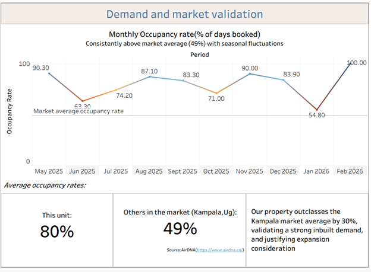
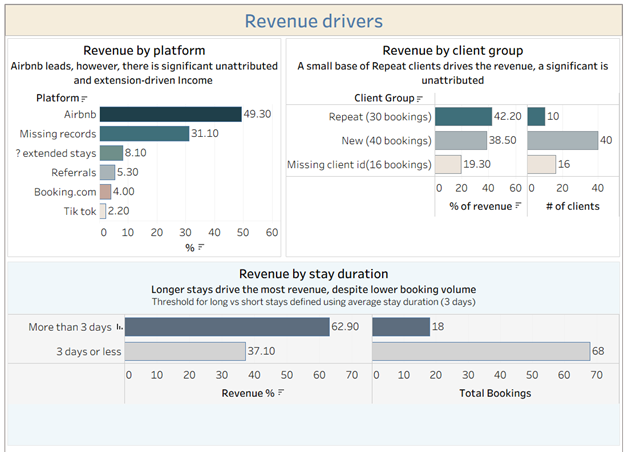
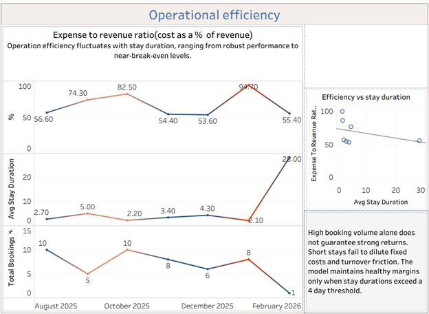
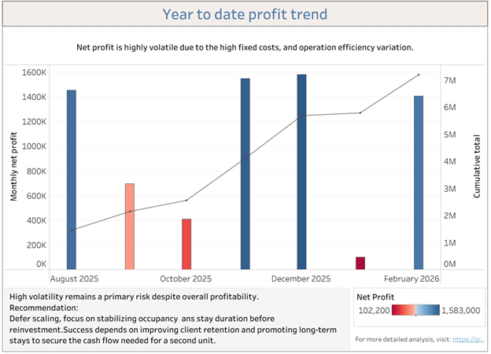

# Strategic Expansion Analysis For a Short Term Rental Business: Amy_Homes

## 1. Project Overview 
This project evaluates the first-year performance of **Amy_Homes**(https://www.airbnb.com/rooms/1399035234946544809 ), a short-term stay (Airbnb) business based in Kampala-Bunga Uganda. 

As the business approached its one-year anniversary, the core objective was to determine whether to reinvest in a second unit or optimize current operations.

## 2. Business Questions
The audit was structured around five strategic inquiries:

* **A. Demand & Market Validation:** Is the current occupancy rate high enough to justify a second unit?

* **B. Revenue Drivers:** How does revenue vary by platform, client group (New vs. Repeat), and booking duration?

* **C. Operational Efficiency:** Is the current unit operating efficiently, or would scaling amplify existing inefficiencies?

* **D. Risk & Stress Testing:** Could the business survive a worst-case scenario? Does revenue cover average monthly expenses in the lowest-performing month?

* **E. Growth & Profitability:** What is the Year-to-Date (YTD) profit trend? Is the current cash flow sufficient to reinvest in a second unit? What is the breakeven occupancy (the "Floor")?

## 3. Data Preparation & Cleaning 
Before the SQL analysis, I performed a rigorous cleaning and preparation phase in Excel to ensure data integrity. This phase was critical for transforming raw booking logs into an analysis-ready dataset:

* **Harmonized Dates:** Standardized disparate date formats and introduced `PAY FROM` and `PAY TO` columns.

* **Client Identification Logic:** Developed a custom primary key logic to generate unique `Client IDs` (e.g., `John-A`) to track repeat guest behavior.

* **Expense Categorization:** Manually mapped and cleaned expense entries using filters and keyword mapping to assign categories to variable costs.

* **Feature Engineering:** Derived variables including `is_extended_booking`, `booking_duration`, and `platform` to improve analysis granularity.

## 4. Database Schema & Documentation
The cleaned data was migrated into a **PostgreSQL** database using two core tables:

* **`revenue`**: A table tracking revenue, guests, platforms, and other booking details.

* **`expenses`**: A table tracking operational expenses, excluding rent.

## 5. Repository Structure
* `/csv`: Contains the cleaned `.csv` datasets and full Dataset Documentation/Schema mapping.

* `/sql`: Contains `schema.sql`, `data_import.sql`, and the `analysis.sql` file, each containing the table creation, data import and analysis queries, respectively.

## 6. Key Insights

### 🏗️ Exceptional Product-Market Fit
The analysis confirmed exceptional product-market fit. While the Kampala market average occupancy sits at **49%** (source: AirDNA), this property averaged **80%**. 
> **Strategic Takeaway:** Demand is not the constraint; operational replication is the primary hurdle for growth.

### 🔄 The Loyalty Backbone
The data revealed that financial strength lies in retention rather than just acquisition. A small segment of repeat clients (**15%**) generated **42% of the total revenue**. 
> **Strategic Takeaway:** Each repeat client is statistically **three times more valuable** than a new one.

### 🎯 The "Duration Power-Law"
**Long-term stays** (>3 days) drive **63% of revenue** despite representing only **26% of total bookings**. Conversely, high-frequency short stays drive up operational costs that erode profit margins.
> **Strategic Takeaway:** Stay duration is the primary driver of operational efficiency.

### ⚠️ Risk & Stress Test
* **The Rent Anchor:** The fixed monthly rent creates a **Breakeven Floor of 14.4 days**.
* **Worst-Case Scenario:** In January 2026, the unit hit a **94.7% expense ratio**. With a net profit of only 102,200 UGX, the business was just **2.6 days of vacancy away** from a net loss.

## 6. Strategic Recommendations
The analysis led to the following data-driven pivots:

* **Targeting "Anchor Guests":** Shifting marketing efforts toward securing stays of 5+ days to reduce operational burnout.

* **System Refinement:** Enhancing internal monitoring to better understand guest behavior, encourage returns, and maximize the lifetime value of every guest.

* **Building a Resilience Buffer:** The "floor month" stress test revealed a thin 2.6-day survival margin (a 94.7% expense-to-revenue ratio). To mitigate this volatility, the growth strategy now includes establishing a liquidity buffer proportional to three months of operating expenses. This ensures the portfolio remains self-sustaining and protected against seasonal dips during expansion.

## 7. Visualizations

### **A. Demand Validation**

*Visualizing the 80% occupancy achievement against the 49% Kampala market average.*

### **B. Revenue Drivers**

*Analysis of the "Duration Power-Law" and the 15% loyalty backbone.*

### **C. Operational Efficiency**

*Aspects affecting the expense-to-revenue ratio.*

### **D. Year to Date Profit Trend**

*Business growth.*

---

**Technical Stack:** 
Excel, PostgreSQL, SQL, Tableau, Visual Studio Code  

**🏢 Property Reference:**
For context on the subject property, the **Amy_Homes** listing can be viewed [here:](https://www.airbnb.com/rooms/1399035234946544809)